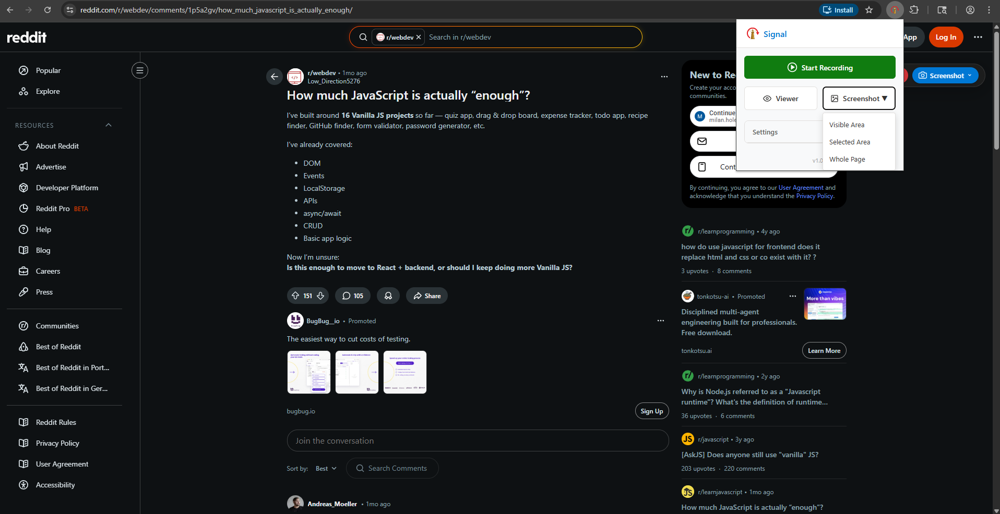
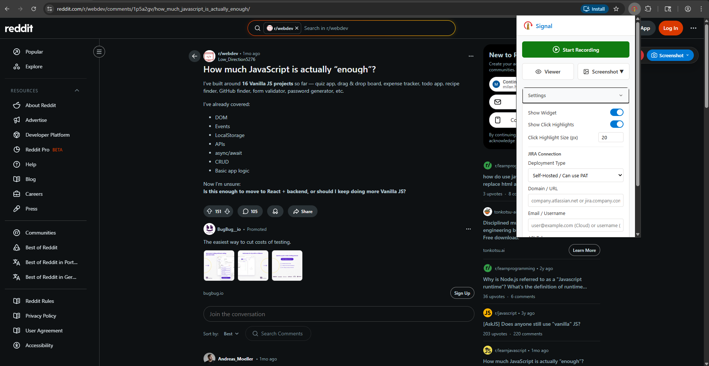
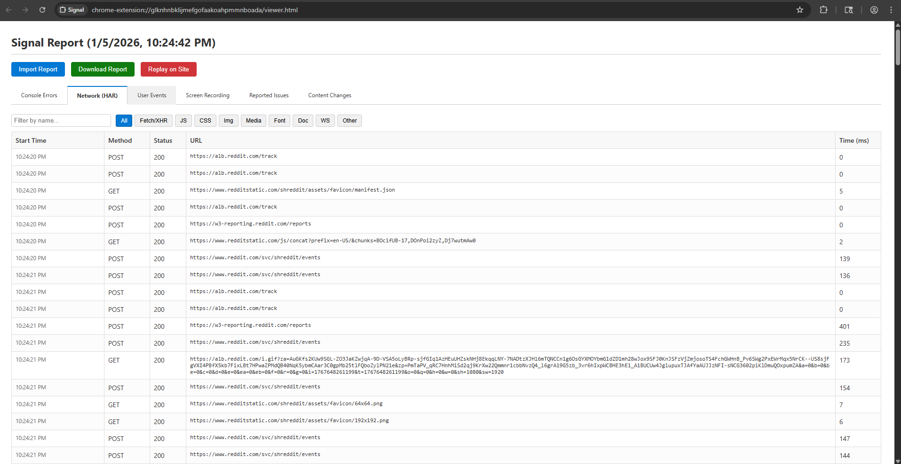
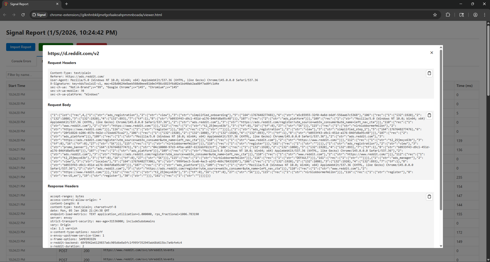
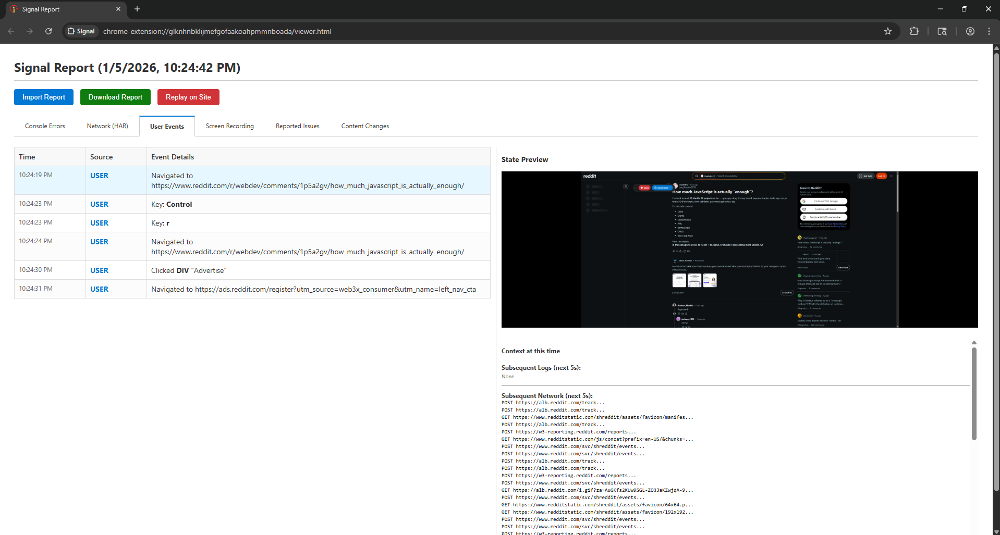
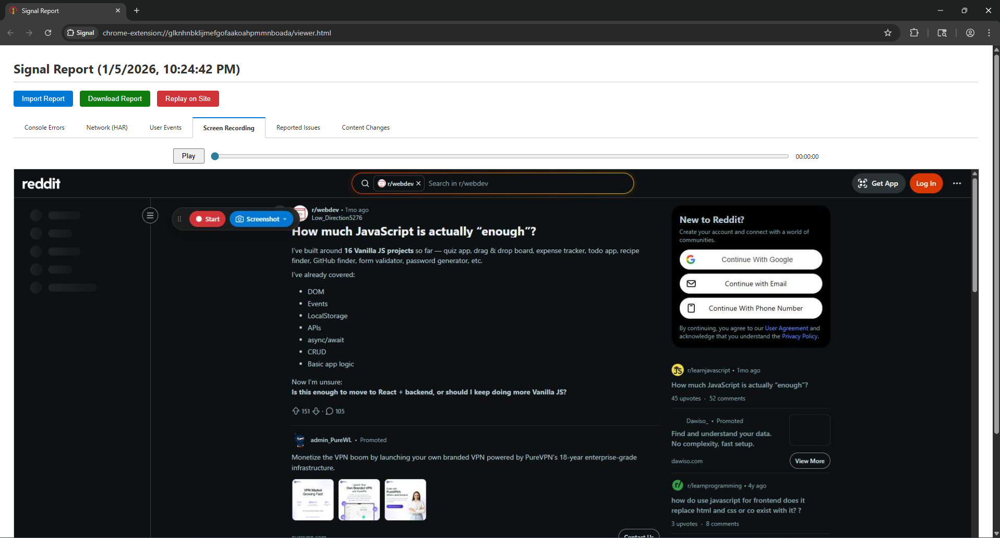

# 🚨 Signal
> **The Ultimate Debugging & Reporting Companion for Chrome**

**Signal** transforms how developers and QA engineers collaborate. It captures *everything*—video, console logs, network traffic, and user interactions—into a single, rich **Investigation Report**. Stop asking "How to reproduce?"; just **play it back**.

---

## ✨ Key Features

### 🎥 Full Context Recording
Capture high-quality **screencasts** synchronized with every **click, scroll, and input**. Signal records the *entire* state of your application, not just a screenshot.

### 🔍 Deep Tech Inspection
Automatically captures:
- **Console Logs**: With clickable stack traces that verify source code.
- **Network Traffic**: Full HAR capture with request/response bodies (and auto-redacted Auth tokens).
- **User Events**: Every interaction is logged to a precise timeline.

### ⚡ Instant Replay on Site
One-click **simulation**. Signal can take control of the browser to physically re-run the recorded session on the live website. Watch the bug reproduce itself!

### 🛠 Live Edit Mode
Don't just report—fix. Use **Edit Mode** to modify text, colors, and styles directly on the page. All changes are tracked and saved in the report for developers to implement.

### 🐛 Visual Issue Reporting
Found a bug?
1. Click **Report**.
2. Draw a box around the issue.
3. Add a comment.
It's instantly pinned to the session timeline with a screenshot.

### 🔗 JIRA Integration
Push comprehensive tickets directly to JIRA. Description, environment details, and the full investigation report are attached automatically.

---

## 🚀 Installation

1. **Clone** the repository locally.
2. Open Chrome and navigate to `chrome://extensions`.
3. Toggle **Developer Mode** (top right switch).
4. Click **Load unpacked** and select the `debug-extension` folder.
5. Pin the **Signal** icon ⚡ to your browser toolbar.

---

## 🎮 Usage Guide

### 1. Start a Session
Click the Signal icon and hit **Start Recording**. A floating control widget will appear on your page. Validated "Buffer Mode" ensures you only keep the last N minutes of logs if you run it all day.

### 2. Capture & Edit
- **Report Issue**: Highlight a bug visually.
- **Edit Content**: Click the "Edit" pencil to tweak UI elements live.
- **Screenshots**: Take precise screenshots that are included in the final package.

### 3. Analyze The Report
When you hit **Stop**, the **Investigation Report** opens:
- **Timeline View**: Correlate errors with user actions.
- **Console & Network**: Filter, search, and deep-dive into headers and payloads.
- **Source Preview**: Click any usage in a stack trace to see the exact line of code.

### 4. Replay
In the viewer, click **Replay on Site**. Signal will open the original URL and re-execute your interactions to reproduce the flow.

---

## 🛡️ Privacy & Security
* **Local First**: All data is stored locally in your browser. Nothing is uploaded to the cloud unless you explicitly attach it to a JIRA ticket.
* **Smart Redaction**: `Authorization: Bearer` tokens and sensitive input fields (password types) are redacted automatically.

---
## 📸 Screenshots

*Generated by Antigravity*
